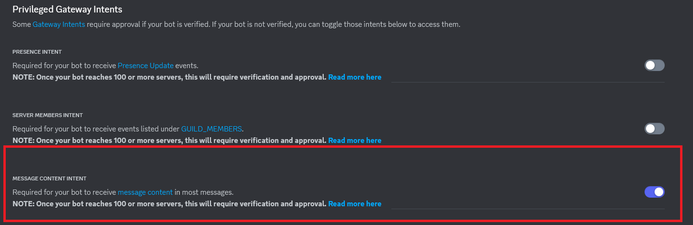
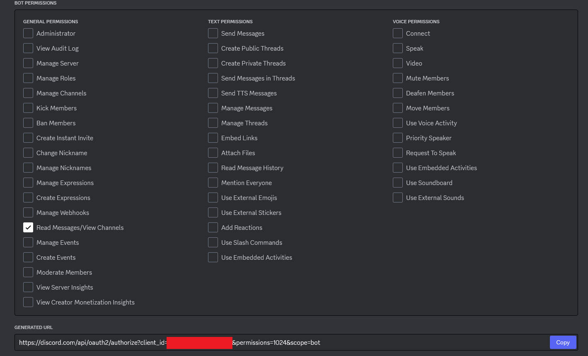
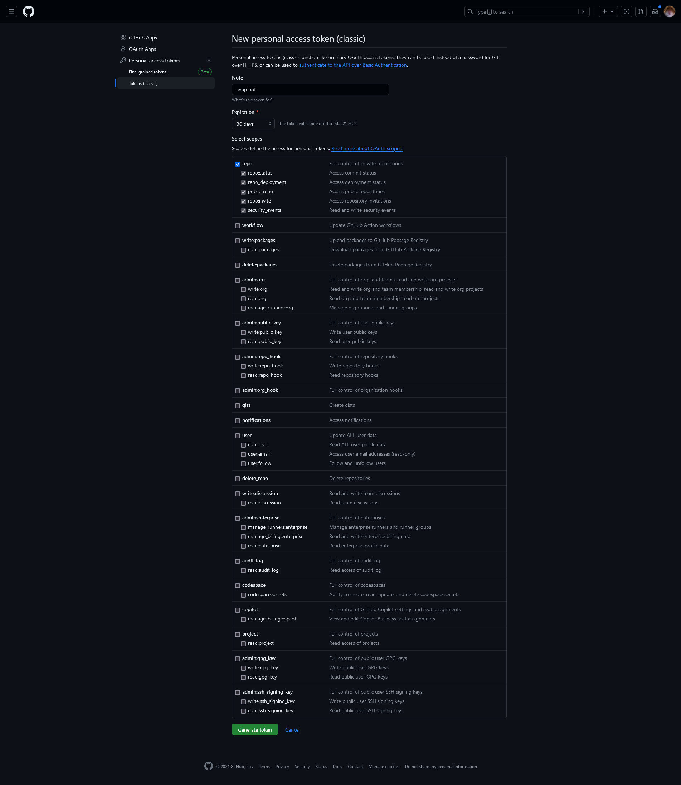

# neptune-bot

A Discord bot that uploads any attachment (image, video) found in new messages to GitHub cos GitHub has free infinite storage :-)

Parameters: 
```
$ ./backupbot.exe -h
  -discord-token string
        Discord Bot access token
  -github-token string
        GitHub access token
  -repository-name string
        The name of the GitHub repository to store snaps to
  -repository-owner string
        The owner of the GitHub repository to store snaps to
```

Sample usage
```
./backupbot.exe \
    -discord-token <my discord token> \
    -github-token <classic github personal token> \
    -repository-owner Chris-Perkins \
    -repository-name Snap
```

# Token setup

## Discord 

You'll need a Discord bot token with "Message Content" intent, and currently only need permission to read data.
To get a Discord bot token, you'll need to create an application here: https://discord.com/developers/applications

Settings -> Bot


Settings -> OAuth2 -> URL Generator


## GitHub

You also need a GitHub personal access token with full repository scope

You can create one here: https://github.com/settings/tokens

